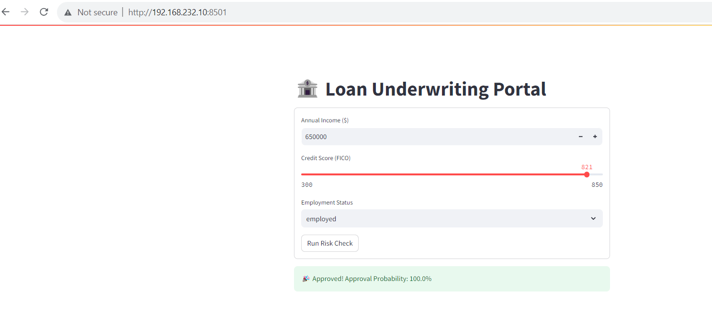

# Loan Approval System using Scikit-learn and Streamlit

## Decision Logic
The decision logic is governed by the machine learning pipeline trained in `train.py` and served via Streamlit:

* **Underlying Model:** A `RandomForestClassifier` trained on historical applicant data from `loan_approval_dataset.csv`.
* **Input Features Evaluated:**
    * **income:** Continuous numeric feature (scaled via `StandardScaler`).
    * **credit_score:** Continuous numeric FICO score ranging from 300 to 850 (scaled via `StandardScaler`).
    * **employment:** Categorical feature (employed, unemployed, self-employed) transformed into binary dummy features using `OneHotEncoder(handle_unknown="ignore")`.
* **Decision Rule:**
    * When submitted, the input payload passes through the combined transformation pipeline into the ensemble of decision trees.
    * The model outputs class probabilities using `predict_proba()`.
    * If the majority vote or classification threshold determines the binary outcome `prediction == 1`, it renders **Approved** along with the calculated probability; otherwise, it flags **Declined**.

## Model Artifact & Serialization
The model artifact is created via serialization with `joblib`:

1. **Preprocessing & Training:** `train.py` bundles the feature transformers (`StandardScaler`, `OneHotEncoder`) and `RandomForestClassifier` into a unified Scikit-Learn `Pipeline`.
2. **Serialization:** Running `train.py` executes:
   ```python
   joblib.dump(pipeline, "loan_model.joblib")
   ```
   This writes the complete pipeline (including fitted scaling parameters, one-hot mappings, and tree weights) into the binary file `loan_model.joblib`.
3. **Docker Build Integration:** In your `Dockerfile`, the instruction `RUN python train.py` runs this script during the image build step, generating `loan_model.joblib` inside the container filesystem before starting Streamlit.
